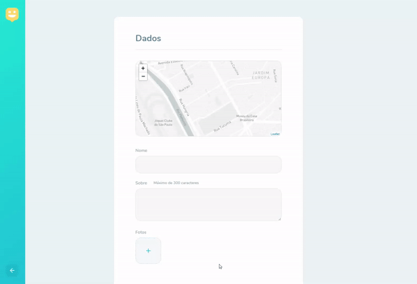

<div align="center" ></div>
<h1 align="center"> Happy </h1>


## Sobre o Happy

O Happy é uma plataforma quee tem como objetivo, facilitar a visita de voluntários a orfanatos. Projeto desenvolvido durante o Next Level Week #3 da [Rocketseat](https://rocketseat.com.br/).


<h3 align="center">Preview</h3>


## Tecnologias utilizadas

- [NodeJS](https://nodejs.org/en/)
- [ReactJS](https://reactjs.org/)
- [React Native](https://reactnative.dev/)
- [Expo](https://expo.io/)
- [Express](https://expressjs.com/)
- [TypeScript](https://www.typescriptlang.org/)
- [Leaflet](https://leafletjs.com/)
- [Mapbox](https://www.mapbox.com/)
- [SQLite3](https://www.sqlite.org/index.html)
- [TypeORM](https://typeorm.io/)


## Instalação dos pacotes e uso

- Use o yarn ou npm

### Backend

```bash
# Clone o repositório ou faça o download do arquivo .zip
$ git clone https://github.com/Geovane-Oliveira/NLW3-Happy.git

# Entre na pasta do backend (Pelo terminal ou manualmente)
$ cd NLW3/backend

# Instale as dependências - Dentro da pasta do backend, execute
$ yarn install

# Rode o servidor
$ yarn dev
```


### Frontend Web

```bash
# Clone o repositório ou faça o download do arquivo .zip
$ git clone https://github.com/Geovane-Oliveira/NLW3-Happy.git

# Entre na pasta do frontend (Pelo terminal ou manualmente)
$ cd NLW3/frontend

# Instale as dependências - Dentro da pasta do frontend, execute
$ yarn install

# Inicie a aplicação
$ yarn start
```

### Aplicativo mobile

<h3>Para execução no Windows</h3>
<br>
- Para executar o aplicativo mobile é necessário ter o emulador de Android do Android Studio.
- Expo Cli
<br>
<h3> Para execução no MacOS </h3>
<br>
- Utilize o emulador do IOS no Mac.
- Expo Cli
<br>
<h3>Para execução no dispositivo mobile físico</h3>
<br>
- Baixe o Expo Client naGoogle Play Store ou App Store
<br>

```bash
# Abra o terminal e instale o Expo CLI de forma global
$ npm install --global expo-cli

# Clone o repositório ou faça o download do arquivo .zip
$ git clone https://github.com/Geovane-Oliveira/NLW3-Happy.git

# Entre na pasta do frontend (Pelo terminal ou manualmente)
$ cd NLW3/mobile

# Instale as dependências - Dentro da pasta do frontend, execute
$ yarn install

# Inicie a aplicação
$ yarn start
```
### Adicionando orfanato
- Entre na tela do mapa
- Clique no botão "+"
- Clique em um ponto do mini mapa (Abaixo de Dados) para adicionar um endereço

- Preencha o formulário