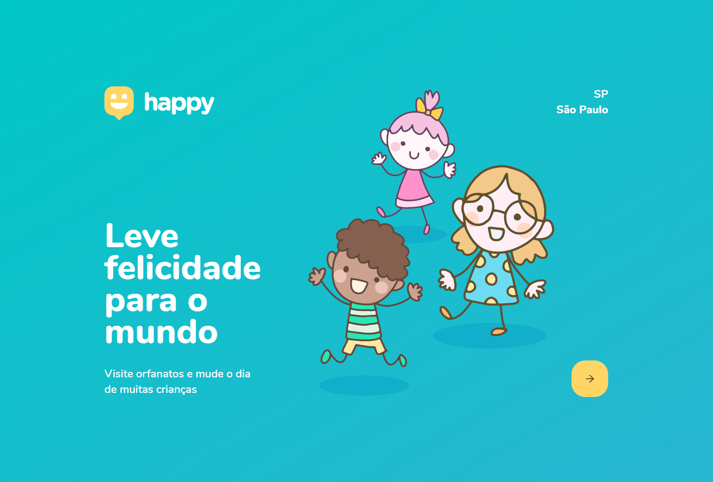
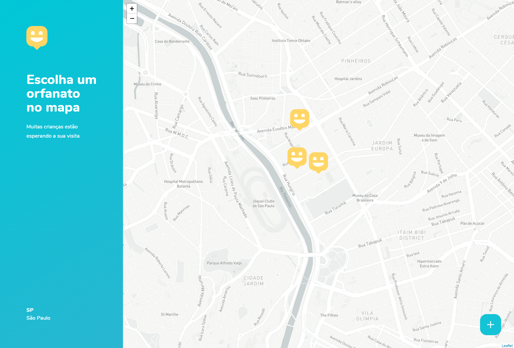

<div align="center" ></div>
<h1 align="center"> Happy </h1>


## Sobre o Happy

O Happy é uma plataforma quee tem como objetivo, facilitar a visita de voluntários a orfanatos. Projeto desenvolvido durante o Next Level Week #3 da [Rocketseat](https://rocketseat.com.br/).


<h3 align="center">Preview</h3>




## Tecnologias utilizadas

- [NodeJS](https://nodejs.org/en/)
- [ReactJS](https://reactjs.org/)
- [TypeScript](https://www.typescriptlang.org/)
- [Leaflet](https://leafletjs.com/)
- [Mapbox](https://www.mapbox.com/)


## Instalação dos pacotes e uso

- Use o yarn ou npm

### Frontend Web

```bash
# Entre na pasta web
$ cd happy/web

# Instale as dependências
$ yarn install

# Inicie a aplicação
$ yarn start
```

<br>
